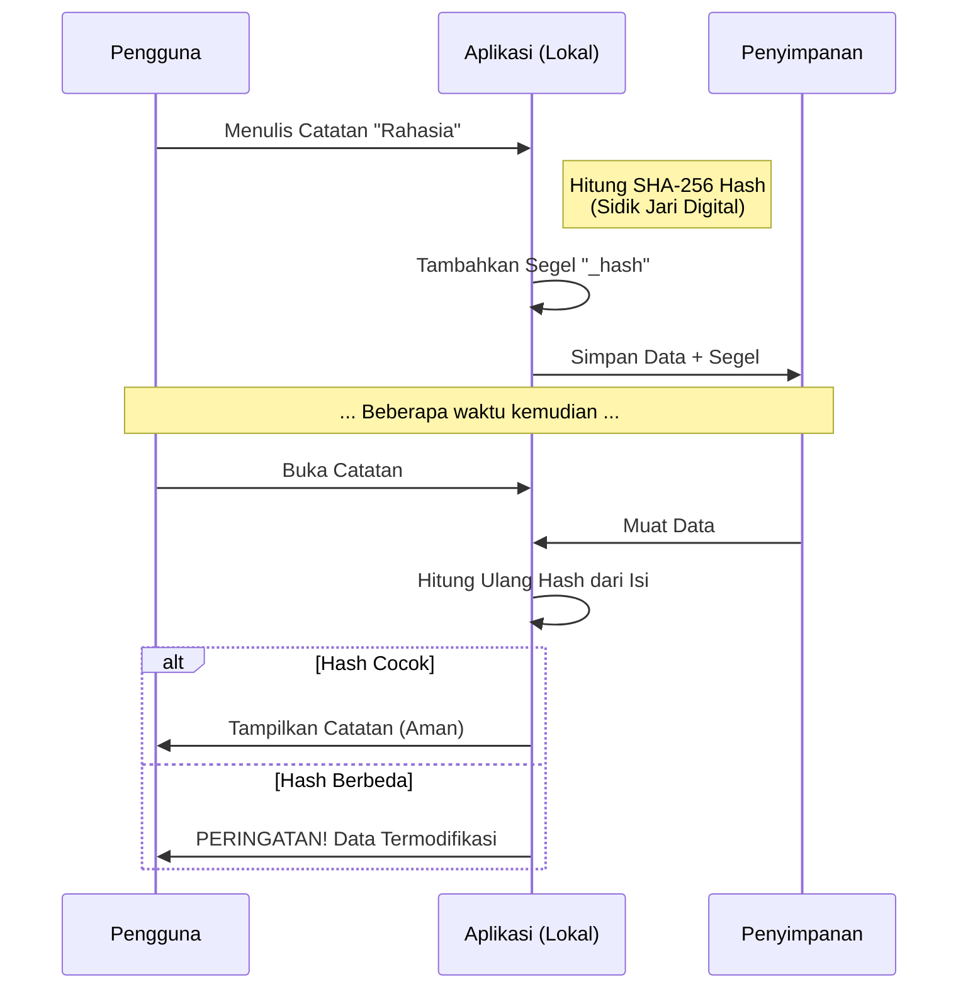
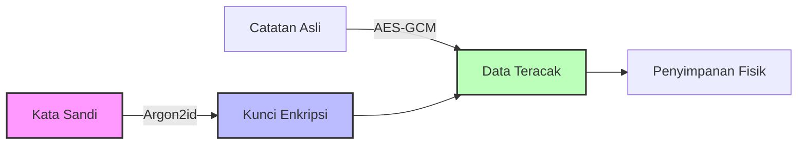

Di Lembaran, keamanan bukan sekadar fitur tambahan, melainkan fondasi utama. Kami menerapkan prinsip **Zero-Knowledge** dan **Integritas Kriptografis** yang terinspirasi dari teknologi blockchain.

## 1. Segel Digital (Integritas Data)

Setiap catatan yang Anda simpan akan diberi "Segel Digital" (Hash SHA-256). Ini berfungsi seperti sidik jari digital yang unik untuk setiap konten.

### Bagaimana Cara Kerjanya?

Jika ada satu karakter saja yang berubah tanpa melalui aplikasi (misalnya dimanipulasi oleh malware), "Segel Digital" akan rusak dan aplikasi akan mendeteksi perubahan tersebut.

## 2. Enkripsi Zero-Knowledge

Kami menggunakan algoritma **Argon2id** (pemenang Password Hashing Competition) untuk mengubah kata sandi Anda menjadi kunci enkripsi yang sangat kuat.

- **Kunci Hanya di Memori**: Kata sandi Anda tidak pernah disimpan ke disk atau dikirim ke server.
- **Isolasi**: Bahkan kami (pengembang) tidak bisa membaca catatan Anda karena kami tidak memiliki kunci tersebut.

## Transparansi Kode

Seluruh logika keamanan ini bersifat *open-source* dan dapat diaudit di file:
- `src/aksara/kunci.ts` (Enkripsi)
- `src/aksara/Integritas.ts` (Validasi Data)
